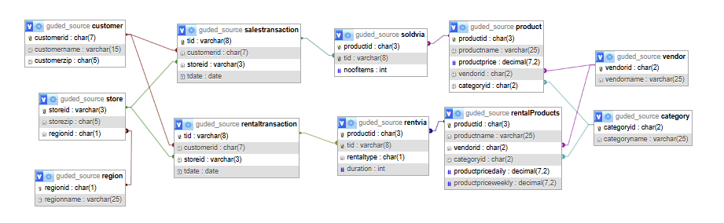
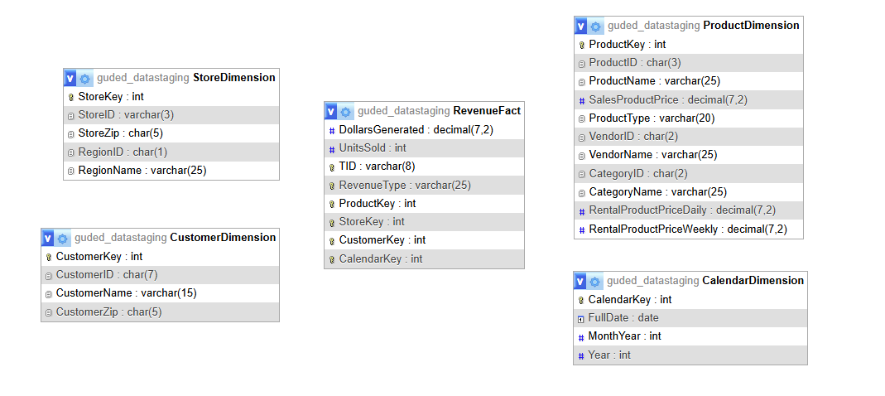
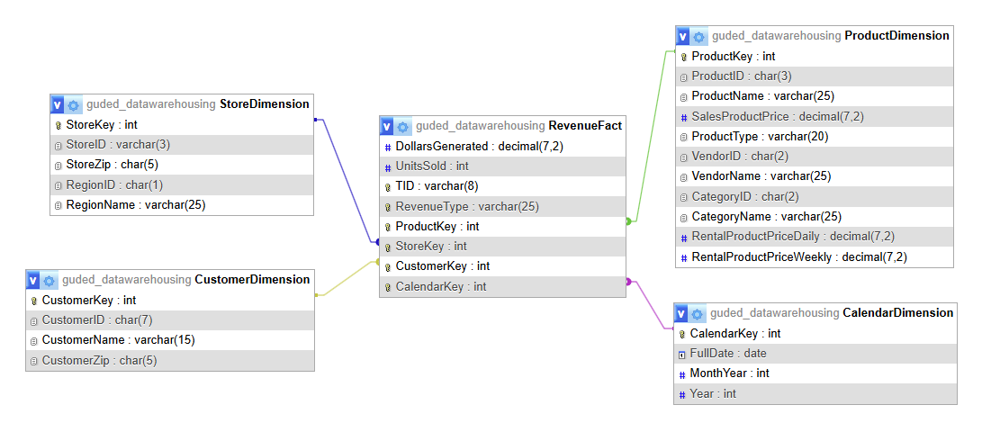
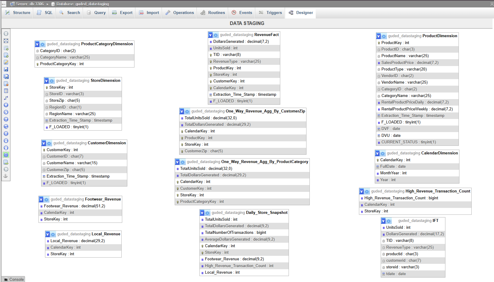
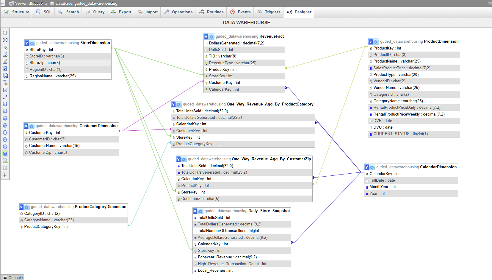

# Retail Data Warehouse and ETL Pipeline

## Overview

This project implements a complete **Retail Data Warehouse** solution for a business that manages both **product sales** and **rental transactions**.

The solution follows a multi-layer architecture consisting of:

- Source OLTP Database
- Data Staging Layer
- Data Warehouse Layer

The project demonstrates several core Data Warehousing concepts, including:

- Dimensional Modeling
- Star Schema Design
- ETL Pipelines
- Incremental Loading
- Late Arriving Fact Processing
- Slowly Changing Dimensions (Type 2)
- Aggregate Tables
- Snapshot Fact Tables

---

# Architecture

## Database Layers

### 1. Source Database (`guded_source`)

The source database represents the operational OLTP system.

It contains transaction-oriented tables such as:

- Vendor
- Category
- Product
- RentalProducts
- Customer
- Store
- Region
- SalesTransaction
- RentalTransaction
- SoldVia
- RentVia

These tables store the raw transactional data generated by the business.

---

### 2. Data Staging Database (`guded_datastaging`)

The staging layer acts as an intermediate area between the source system and the data warehouse.

#### Responsibilities

- Data Extraction
- Data Cleansing
- Data Transformation
- Surrogate Key Generation
- Incremental Refresh Processing
- Late Arriving Fact Management

#### Dimension Tables

- ProductDimension
- CustomerDimension
- StoreDimension
- CalendarDimension

#### Fact Table

- RevenueFact

#### Aggregate Tables

- ProductCategoryDimension
- One_Way_Revenue_Agg_By_ProductCategory
- One_Way_Revenue_Agg_By_CustomerZip

#### Snapshot Tables

- Daily_Store_Snapshot

---

### 3. Data Warehouse Database (`guded_datawarehousing`)

The warehouse layer stores analytical data using a Star Schema design.

The warehouse receives transformed and validated data from the staging area and serves as the analytical reporting database.

---

# Architecture Diagrams

## Source OLTP ER Diagram

The following diagram illustrates the operational source database schema used to capture sales and rental transactions.




---

## Initial Staging ER Diagram

This diagram shows the initial staging-layer design used for data extraction, transformation, cleansing, and incremental processing.



---

## Initial Data Warehouse ER Diagram

This diagram represents the first version of the dimensional model before implementing aggregate tables, snapshot tables, incremental refreshes, and Slowly Changing Dimensions (Type 2).



---

# Star Schema Design

The Data Warehouse follows a Star Schema consisting of dimension tables and a central fact table.

## Dimension Tables

### ProductDimension

Contains:

- Product information
- Product type (Sales or Rental)
- Vendor information
- Category information
- Sales and rental pricing information

### CustomerDimension

Contains:

- Customer information
- Customer ZIP code information

### StoreDimension

Contains:

- Store information
- Regional information

### CalendarDimension

Contains:

- Full Date
- Month-Year
- Year

---

## Fact Table

### RevenueFact

Stores business measures including:

- Units Sold
- Dollars Generated

The fact table is connected to:

- ProductDimension
- CustomerDimension
- StoreDimension
- CalendarDimension

#### Revenue Types

- Sales
- Rental Daily
- Rental Weekly

---

# ETL Process

## Extract

Data is extracted from the operational source database:

```text
guded_source
```

and loaded into:

```text
guded_datastaging
```

Examples:

- Products
- Customers
- Stores
- Sales Transactions
- Rental Transactions

---

## Transform

Several transformations are performed in the staging layer.

### Product Consolidation

Sales products and rental products are consolidated into a single Product Dimension.

### Revenue Calculations

#### Sales Revenue

```text
Revenue = UnitsSold × ProductPrice
```

#### Rental Revenue

```text
Revenue = Duration × DailyPrice
```

or

```text
Revenue = Duration × WeeklyPrice
```

depending on rental type.

### Calendar Dimension Generation

A stored procedure generates more than 8,000 calendar records beginning from January 1, 2013.

---

## Load

After transformation, data is loaded from:

```text
guded_datastaging
```

into

```text
guded_datawarehousing
```

Dimensions are loaded prior to loading the fact table.

---

# Incremental Fact Refresh

Incremental loading is implemented using the procedure:

```sql
RevenueFact_Refresh
```

This procedure:

1. Detects new transactions from the source system.
2. Creates an Intermediate Fact Table (IFT).
3. Loads new facts into the staging database.
4. Loads new facts into the warehouse.
5. Updates refresh indicators.

### Additional Columns Used

```text
Extraction_Time_Stamp
F_LOADED
```

These attributes support incremental ETL execution.

---

# Late Arriving Fact Processing

Implemented through:

```sql
Late_Arriving_RevenueFact_Refresh
```

This procedure handles transactions that arrive after their expected ETL window.

Late arriving records are detected by identifying Transaction IDs that do not already exist within the RevenueFact table.

---

# Dimension Refresh Procedures

Separate refresh procedures were created for each dimension.

## ProductDimension_Refresh

Handles:

- New Sales Products
- New Rental Products

## CustomerDimension_Refresh

Handles:

- New Customers

## StoreDimension_Refresh

Handles:

- New Stores

---

# Slowly Changing Dimensions (SCD Type 2)

The project implements **Slowly Changing Dimension Type 2** to preserve historical records.

Additional attributes were introduced:

```text
DVF (Date Valid From)
DVU (Date Valid Until)
CURRENT_STATUS
```

---

## ProductDimension Type 2

### Tracked Attributes for Sales Products

- ProductName
- VendorID
- VendorName
- SalesProductPrice

### Tracked Attributes for Rental Products

- ProductName
- VendorID
- VendorName
- RentalProductPriceDaily
- RentalProductPriceWeekly

### Procedure

```sql
ProductDimension_Type2Changes_Refresh
```

### Type 2 Process

When a tracked attribute changes:

1. The existing record is expired.
2. DVU is updated.
3. CURRENT_STATUS becomes FALSE.
4. A new record version is inserted.
5. Historical product records remain available for analysis.

---

## CustomerDimension Type 2

### Tracked Attributes

- CustomerName
- CustomerZip

### Procedure

```sql
CustomerDimension_Type2Changes_Refresh
```

### Type 2 Process

When a customer attribute changes:

1. Existing record is expired.
2. DVU is updated.
3. CURRENT_STATUS becomes FALSE.
4. A new version of the customer record is inserted.

This allows complete tracking of customer history through time.

---

# Aggregate Tables

## ProductCategoryDimension

A supporting aggregate dimension used for category-level reporting.

---

## One_Way_Revenue_Agg_By_ProductCategory

Provides category-level revenue analysis.

### Measures

- Total Units Sold
- Total Dollars Generated

---

## One_Way_Revenue_Agg_By_CustomerZip

Provides geographical revenue summaries.

### Measures

- Total Units Sold
- Total Dollars Generated

### Grouped By

- Calendar
- Product
- Store
- Customer ZIP

---

# Daily Store Snapshot

The Daily Store Snapshot table stores daily operational metrics for each store.

## Sales Metrics

- Total Units Sold
- Total Dollars Generated
- Total Number of Transactions
- Average Dollars Generated

## Derived Metrics

### Local Revenue

Revenue generated from customers whose ZIP-code prefix matches the store ZIP-code prefix.

### High Revenue Transaction Count

Number of transactions whose total revenue exceeds $100.

### Footwear Revenue

Revenue generated from products belonging to the Footwear category.

---

# Stored Procedures Implemented

## Fact Refresh Procedures

- RevenueFact_Refresh
- Late_Arriving_RevenueFact_Refresh

## Dimension Refresh Procedures

- ProductDimension_Refresh
- CustomerDimension_Refresh
- StoreDimension_Refresh

## Type 2 Refresh Procedures

- ProductDimension_Type2Changes_Refresh
- CustomerDimension_Type2Changes_Refresh

---

# Final Database Designs

## Data Staging Database Schema

The staging layer contains transformed dimensions, facts, aggregate tables, refresh metadata, and ETL support structures.



---

## Final Data Warehouse Schema

The final warehouse follows a star-schema architecture optimized for analytics and historical tracking.



---

# Project Documentation

ER diagrams are located in the `docs/` folder.

### Files

- `initial_staging_ER.png`
- `initial_warehouse_ER.png`
- `Warehouse_ER.png`

These diagrams illustrate the evolution of the data model from the staging architecture to the final warehouse star schema.

---

# Technologies Used

- MySQL
- SQL
- ETL Design
- Data Warehousing
- Star Schema Modeling
- Slowly Changing Dimensions (Type 2)
- Incremental Data Loading
- Aggregate Table Design
- Snapshot Fact Modeling

---

# Key Learnings

This project provided hands-on experience with:

- Data Warehouse Architecture
- ETL Pipeline Development
- Star Schema Design
- Aggregate Modeling
- Snapshot Fact Tables
- Incremental Data Refresh Strategies
- Late Arriving Fact Processing
- Surrogate Key Management
- Slowly Changing Dimensions